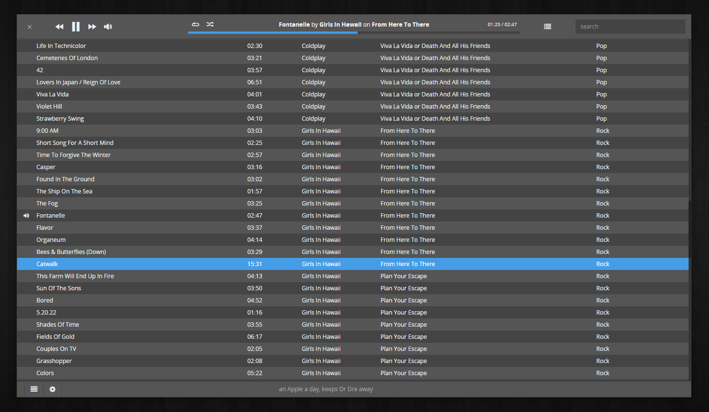

# museeks
A cross-platform music player, in active development. **0.1 is will be released soon.**

It uses:
* [io.js](http://iojs.org/) for back-end
* [electron (used to be atom-shell)](https://github.com/atom/atom-shell/) for embedded browser
* [react.js](https://facebook.github.io/react/) as front-end framework

===

### Features

- Lightweight music player
- Queue management
- Shuffle, loop
- Supported formats:
    - mp3
    - ogg
    - wav

on deck:

- Playlists ([#22](https://github.com/KeitIG/museeks/issues/22))
- flac support ([#53](https://github.com/KeitIG/museeks/issues/53))

===

### Installation

Please consider **this app is still under development, just install it for fun**, I'm aware of multiple bugs and designs issues.

- Download [Electron](https://github.com/atom/electron/releases)
- Download Museeks source code
- Put it in a folder called `app` in `[Electron path]/resources`
- `bower install && npm install && npm run dev`
- Run Electron

===

### Contribute

- Fork and clone
- You will need `bower` and `webpack` installed globally
- `bower install && npm install && npm run dev`
- Don't forget to enable dev mode in the app in the settings view
Webpack will watch for JSX and SASS changes.

Please respect a few rules:
- Make the code readable and comment if needed
- 4 spaces indent !
- Before making complex stuff, don't hesitate to open an issue first to discuss about it

Then open a PR :)

===

### To-do list

This list is not limited. Features findable in issues with the `to-do` tag will be achieved first.

##### discussion

- [x] refactor once it's frozen
- [x] use es6 and Babel
- [x] `routie.js` to `react-router`
- [x] `gulp` to `webpack`
- [x] `nconf` to `localStorage`
- [ ] build system for each platform (.exe, .app, .deb...) need help on this one

##### general
- [x] shortcuts & global shortcuts
- [x] have a real development stack to generate views, scss, etc...
- [x] dark theme

##### settings view
- [x] add/remove music folder
- [x] refresh library with the given folders

##### library view list
- [x] list all tracks
- [ ] manage columns
- [ ] resize columns
- [x] search

##### player
- [x] make it works ftw !
- [x] auto-read next track
- [x] next/previous button
- [x] list next tracks
- [x] manage next tracks
- [x] shuffle
- [x] loop, single-loop

##### nice to have
- [ ] add languages support
- [ ] auto-updater from Github releases
- [ ] playlists
- [x] async search
