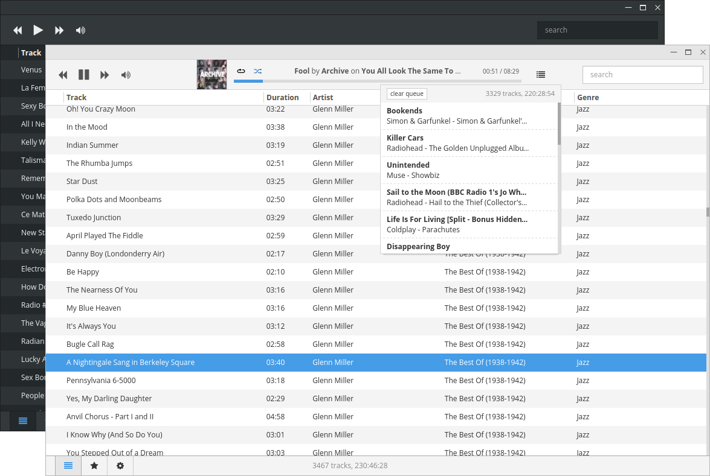

# Museeks

A simple, clean and cross-platform music player. ([museeks.io](http://museeks.io))

> **Note**
> Museeks is on its way to a big rewrite with some major UI changes, please help shape the future of the music player [in the discussions section](https://github.com/martpie/museeks/discussions)! :]

## Features

Museeks aims to be a simple and easy to use music player with a clean UI.

You will not find tons of features, as it goal is not to compete with more complete and more famous music players. Here is a little preview though:

- 💻 Cross-platform music player (Linux, macOS and Windows)
- 🎧 Supported formats: mp3, mp4, m4a/aac, flac, wav, ogg, 3gpp
- ✨ Clean and polished
- 🌟 Playlists
- 🎼 Queue management
- ➰ Shuffle, loop
- 🌄 Covers
- 🤓 Dark theme
- 🚤 Playback speed control
- 😴 Sleep mode blocker
- 🔄 `.m3u` import/export

Want more? Open a new issue or 👍 an existing one so we can talk about it.

## Releases notes

[Over here!](https://github.com/martpie/museeks/releases)

## Installation

### Classic

Binaries can be found [on this page](https://github.com/martpie/museeks/releases).

### Build (advanced)

Museeks is built upon:

- [Node.js](https://nodejs.org/en/)
- [Electron](https://github.com/electron/electron/)
- [React.js](https://react.dev)

Requirements:

- `node` > 18
- `yarn` 1

Please consider that **`master` is unstable**.

- `git clone git@github.com:martpie/museeks.git`
- `cd museeks`
- `yarn`
- for dev mode:
  - `yarn dev`
  - `yarn museeks:debug` (in another terminal)
- for prod mode:
  - `yarn build`
  - `yarn museeks`

### Package binaries (advanced)

- `rm -rf node_modules dist build`
- `yarn`
- `yarn build`
- to test the production build:
  - `yarn museeks` or `yarn museeks:debug`
- to test packaging `yarn package:lmw`, or:
  - `yarn package:l` (linux-only)
  - `yarn package:m` (mac-only)
  - `yarn package:w` (windows-only)

## Troubleshooting

Museeks is currently in development. This implies some things can break after an update (database schemes changes, config...).

If you encounter freezes or crashes when using the app, you can reset Museeks by following these steps:

- Go to the Museeks folder directory
  - Windows: `%AppData%\museeks`
  - OSX: `~/Library/Application Support/museeks`
  - Linux: `~/.config/museeks/` or `$XDG_CONFIG_HOME/museeks`
- Delete:
  - `IndexedDB` folder
  - `config.json` file
- Restart Museeks

If you still get problems after that, please open an issue :)

## Bug report

If you want to report a bug, first, thanks a lot, that helps us a lot. Please open an issue and mention your OS, your Museeks version, and how to reproduce it. Adding a screen of the console (Menu -> View -> Toggle Developer Tools) is a big help too.

## Contribute

- Fork and clone
- Master may be unstable, checkout to a tag to have a stable state of the app
- `yarn install --frozen-lockfile && yarn run dev` then run in a separate terminal `yarn run museeks:debug`
- `yarn run dev` will launch electron and compile the app. Hot reload will work out of the box.

Please respect a few rules:

- Before making complex stuff, don't hesitate to open an issue first to discuss about it ;)
- Understandable code > short code: comment if needed
- Make sure your build pass

Then open a PR :)
